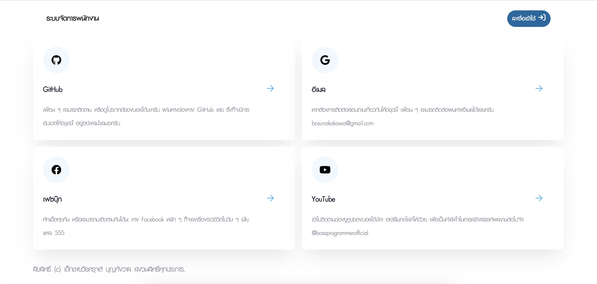

# About this project

This project provided the users management system for organization, Friendly to use and new technology.

## Environment Variables

To run this project, you will need to add the following environment variables to your .env file

`APP_KEY` is your generated Laravel application key.

`DB_DATABASE` is your database name (MySQL).


## Workflow


## Installation

Install laravel_employee_management with npm

```bash
  composer install && npm install
```

## Deployment

To deploy this project run

```bash
  npm run dev && php artisan serve
```


## Tech Stack

**Frontend:** Blade Template, TailwindCSS

**Backend:** Laravel, Vite


## Features

- Light/dark mode toggle (Dashboard)
- Manage Admins and Users
- Fully Responsive Design
- Secure Auth System


## Screenshots




## Authors

- [@veerasaroot](https://www.github.com/veerasaroot)


## Contributing

Contributions are always welcome!

See `contributing.md` for ways to get started.

Please adhere to this project's `code of conduct`.


## License

[MIT](https://choosealicense.com/licenses/mit/)

